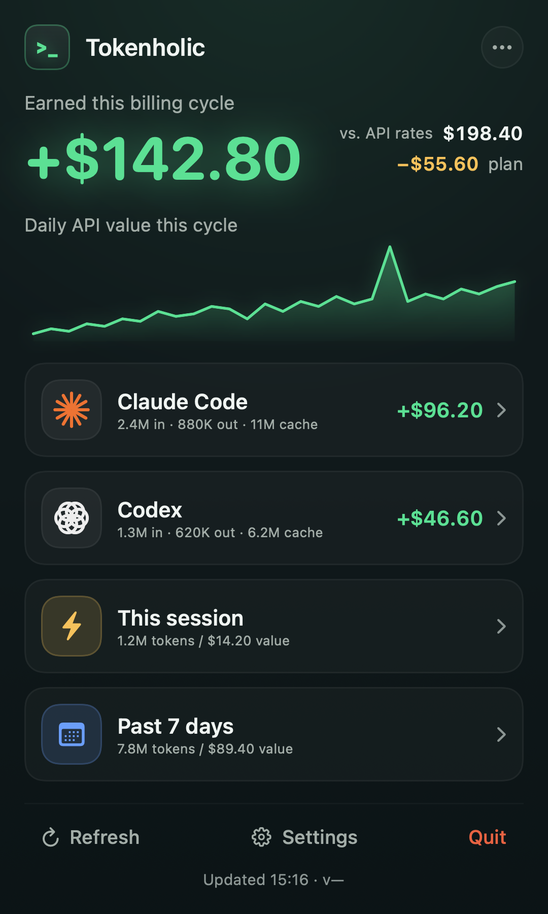

# Tokenholic

A native macOS menubar app that shows how much you **earn from your AI coding
subscriptions** — i.e. what your token usage would cost at API rates versus what
you pay for your plan. Like [ccusage](https://github.com/ryoppippi/ccusage), but
framed as subscription ROI and live in the menubar.

<p align="center">
  
</p>

The headline number is your **net earnings this billing cycle**:

```
API-equivalent cost of this cycle's tokens  −  your monthly subscription price
```

## Supported tools

| Tool | Source | Status |
|------|--------|--------|
| **Claude Code** | `~/.claude/projects/**/*.jsonl` (local) | ✅ validated against ccusage to the cent |
| **Codex** | `~/.codex/sessions/**/*.jsonl` (local) | ✅ OpenAI sessions |
| **Cursor** | dashboard API (cookie) | ▢ planned (experimental) |

Pricing comes from the same [LiteLLM price table](https://github.com/BerriAI/litellm)
ccusage uses (fetched live, cached 24h, with an embedded offline fallback), keyed
by exact model id. The 5m/1h prompt-cache split is priced separately, matching
Anthropic's billing.

## Requirements

- macOS 14+
- Xcode / Swift 6 toolchain

## Build & run

```sh
make          # build, assemble, and ad-hoc-sign Tokenholic.app
make run      # build and launch
```

It runs as a menubar agent (no Dock icon). Click the menubar item for the
popover: per-tool earnings cards, a daily-value sparkline, the last-5h value,
and Settings (plan prices, billing day, launch-at-login).

### Debug / verify

```sh
.build/release/Tokenholic --dump   # prints the full pipeline + a per-model
                                # breakdown for cross-checking against ccusage,
                                # plus an incremental-store idempotency check
```

## Architecture

```
Collectors  →  Normalizer  →  PricingEngine  →  EarningsCalculator  →  AppModel → UI
(per tool)     (dedup,        (LiteLLM rates,   (monthly cycle,         (FSEvents-
               drop synth)    cache-aware)      blended, daily)         driven)
```

- **Collectors** (`UsageCollector`): `ClaudeUsageStore` (incremental, append-only
  tail reads via byte offsets), `CodexCollector` (cumulative `total_token_usage`
  deltas). New tools drop in behind the protocol.
- **Normalizer**: dedups Claude records on `(messageId, requestId)`, drops
  `<synthetic>`.
- **PricingEngine** / **PricingProvider**: exact-key lookup with family fallback;
  live LiteLLM + embedded snapshot.
- **EarningsCalculator**: pure function → per-tool + blended earnings for the
  current billing cycle, plus the daily series.
- **AppModel**: orchestrates; FSEvents triggers incremental rescans, a 60s timer
  refreshes time-based windows.

## Cross-device sync

Sign in (Google or GitHub) and Tokenholic shows a **combined total across all your
devices**. Each device upserts its own small per-device summary to a lightweight
[Supabase](https://supabase.com) backend; Row-Level Security scopes every user to
their own data, and the anon key (the only key shipped) can't read anyone else's.
Every device reads them all and aggregates — the subscription is counted **once**.
Setup: [SUPABASE_SETUP.md](SUPABASE_SETUP.md).

## Releasing

DMGs are built by a GitHub Action (`.github/workflows/build-dmg.yml`) — universal
(Intel + Apple Silicon), Developer-ID-signed + notarized when the signing secrets
are present, ad-hoc otherwise. See [RELEASING.md](RELEASING.md).

## Roadmap

- Cursor support (experimental; dashboard API + session cookie)
- Supabase Realtime for live cross-device updates
- Native Sign in with Apple (requires Developer ID)

## License

Tokenholic is free software, licensed under the **GNU General Public License v3.0**
— see [LICENSE](LICENSE).

Copyright (C) 2026 Tony Huang
